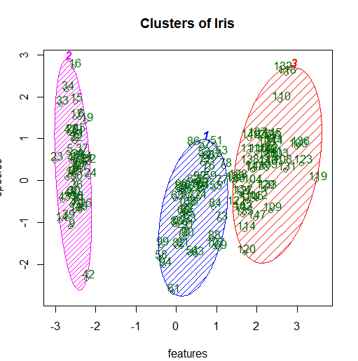

# Evaluation Practice No. 4
## K-Means Clustering

## [Video pendiente]()

### Explanation
First the working directory is set up to work with the files in the current folder
```r
getwd()
setwd("Z:\\tec\\8vo\\mineria\\practicas\\evaluatoria4")
```

Then the dataset is loaded, its name is Iris.csv and it contains data about some flowers and the species they belong to
```r
#read dataset
dataset <- read.csv("Iris.csv")
#since significant variables where not specified, we asume all features are significant
dataset = dataset 
```

A seed is set as well as a wcss vector variable that will be useful when trying to apply the elbow method
```r
#set and wcss vector for elbow method
set.seed(6)
wcss = vector()
```

Transform the species variable from a discrete variable to a numerical factor to be processable
```r
#transformation to factor from categorical variable, needed for the clustering
dataset$species = factor(dataset$species,
       levels = c('setosa', 'versicolor', 'virginica'),
       labels = c(1, 2, 3))
```

Elbow method, a plot to be analyzed to find the optimal k value, which is the number of clusters where the classification performs the best.
```r
#elbow method, we must make a plot and see where the cluster incrementation stops being optimal
for (i in 1:10) wcss[i] = sum(kmeans(dataset, i)$withinss)
plot(1:10,
     wcss,
     type= 'b',
     main = paste('Elbow method'),
     xlab = 'n clusters',
     ylab = 'WCSS')
```


Using the elbow method withe the seed of 6 it was found that k = 3 is the best option for clustering, it means 3 clusters. So the kmeans function is called with the dataset setting centers as 3 which is k and y_kmeans being the cluster data
```r
# k optimal, k = 3
# applying k means, centers = k
set.seed(36)
kmeans = kmeans(x = dataset, centers = 3, iter.max = 100)
y_kmeans = kmeans$cluster
```

Finally, the results are show, first the results of the model shown as text and then the plot showing the clustering of the data, this using the library cluster with its function clusplot special for cluster rendering
```r
# see additional data of the model as how many elements fell in every cluster
kmeans

#visualization of the clusters
library(cluster)
clusplot(dataset,
         y_kmeans,
         lines = 0,
         shade = TRUE,
         color = TRUE,
         labels = 2,
         plotchar = FALSE,
         span = TRUE,
         main = paste('Clusters of Iris'),
         xlab = 'features',
         ylab = 'species')
#where 1: setosa, 2: versicolor, 3: virginica
```

### Results




### FullCode
```r
getwd()
setwd("Z:\\tec\\8vo\\mineria\\practicas\\evaluatoria4")

#read dataset
dataset <- read.csv("Iris.csv")
#since significant variables where not specified, we asume all features are significant
dataset = dataset 

#set and wcss vector for elbow method
set.seed(6)
wcss = vector()

#transformation to factor from categorical variable, needed for the clustering
dataset$species = factor(dataset$species,
       levels = c('setosa', 'versicolor', 'virginica'),
       labels = c(1, 2, 3))

#elbow method, we must make a plot and see where the cluster incrementation stops being optimal
for (i in 1:10) wcss[i] = sum(kmeans(dataset, i)$withinss)
plot(1:10,
     wcss,
     type= 'b',
     main = paste('Elbow method'),
     xlab = 'n clusters',
     ylab = 'WCSS')

# k optimal, k = 3
# applying k means, centers = k
set.seed(36)
kmeans = kmeans(x = dataset, centers = 3, iter.max = 100)
y_kmeans = kmeans$cluster

# see additional data of the model as how many elements fell in every cluster
kmeans

#visualization of the clusters
library(cluster)
clusplot(dataset,
         y_kmeans,
         lines = 0,
         shade = TRUE,
         color = TRUE,
         labels = 2,
         plotchar = FALSE,
         span = TRUE,
         main = paste('Clusters of Iris'),
         xlab = 'features',
         ylab = 'species')
#where 1: setosa, 2: versicolor, 3: virginica

```
